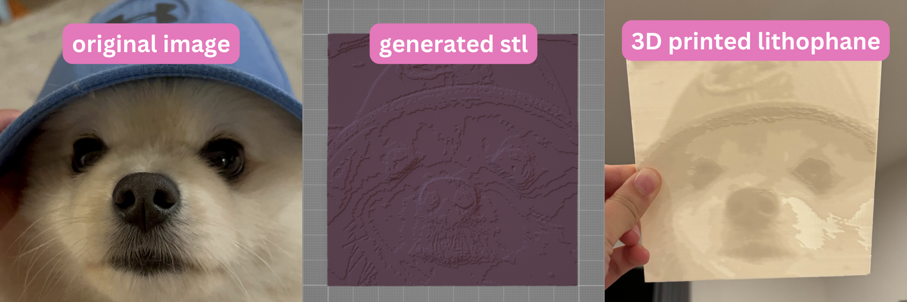

# Image to Lithophane STL Generator (React + JS)

This web-based tool allows users to convert a grayscale image into an STL file for 3D printing as a lithophane. A lithophane is an embossed, translucent image that is visible when illuminated from behind. The web app creates a 3D model with varying thickness based on the brightness of the pixels in the image.

Built with **React** and **JavaScript**, this project brings a traditionally offline lithophane generation process into a fast and user-friendly web interface.

## ⭐ Features

- Converts any image into a 3D lithophane STL.
- Adjusts the model’s thickness based on brightness (lighter areas are thinner, darker areas are thicker).
- Allows scaling and reducing the resolution of the image for optimized 3D printing.
- Configurable parameters for lithophane size, thickness, and detail level.
- Outputs STL files ready for 3D printing in millimeters.

## 🚀 Getting Started

 1. Visit the [website](uijincho.github.io/lithophane-js)
 2. Upload your image
 3. Adjust the parameters to your liking
 4. Generate the lithophane STL!

## 🧮 3D Printing Recommendations
- Print Orientation: Always print lithophanes vertically to maximize detail.
- Material: Translucent filaments like white or clear PLA work best for lithophanes.
- Layer Height: Use a layer height of 0.1-0.2 mm for best results.
- Infill: Higher infill percentages (around 100%) will provide better light diffusion through the lithophane.

## 🧠 License
This project is licensed under the MIT License. See the [LICENSE](LICENSE) file for details.

## 📝 Contributing
Feel free to submit issues or pull requests! Contributions are welcome.
